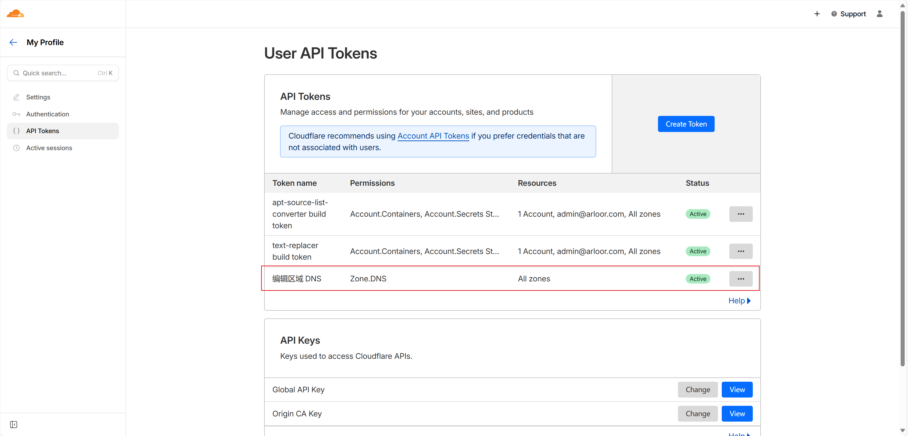
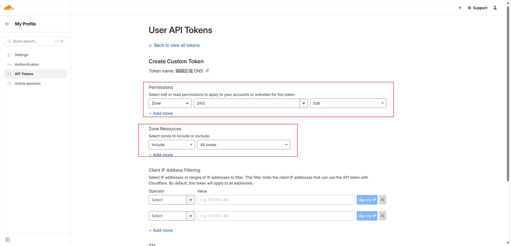

# DDNS - Multi-Provider Dynamic DNS Client

A Rust-based DDNS client that supports DNSPod and Cloudflare, with multiple domains and TOML configuration.

## Features

- 支持多个 DNS 提供商（DNSPod 和 Cloudflare）
- 支持多个域名配置
- 基于 TOML 配置文件
- 命令行参数支持
- 自动 IP 变化检测
- 强制更新机制
- IP 变化 Hook 通知支持
- 详细的日志记录
- 可选的无控制台窗口模式（Windows）

## 安装和使用

### 1. 编译程序

```bash
# 标准编译（显示控制台窗口）
cargo build --release

# 无控制台窗口编译（适用于 Windows 后台运行）
cargo install --path . --features no-console
```

### 2. 配置文件

创建 `config.toml` 配置文件（或使用 `-c` 参数指定其他路径）：

```toml
# DDNS配置文件 - 支持DNSPod和Cloudflare
# 间隔时间（秒）
sleep_secs = 120
# 每隔几次强制从DNS provider获取最新的记录
force_get_record_interval = 5

# 默认DNS Provider类型 ("dnspod" 或 "cloudflare")
default_provider = "dnspod"

# 默认配置（可选）
# DNSPod默认配置
default_dnspod_token = "your_dnspod_token_id,your_dnspod_token_secret"

# Cloudflare默认配置
default_cloudflare_token = "your_cloudflare_api_token"
# 可选：Cloudflare Account ID（用于加速Zone查询）
# default_cloudflare_account_id = "your_cloudflare_account_id"

# 默认IP查询URL
default_ip_url = "https://api.ipify.org"

# 默认IP变化时执行的hook指令（可选）
default_hook_command = "echo \"IP changed to $NEW_IP for $DOMAIN\" >> /var/log/ddns.log"

# 域名配置列表
# DNSPod支持多级子域名格式：
# - "sub.example.com" 表示一级子域名
# - "api.v2.example.com" 表示二级子域名
# - "@.example.com" 或 "example.com" 表示根域名
# Cloudflare使用完整的FQDN

# DNSPod示例：使用默认配置
[[domains]]
domain = "blog.example.com"
provider = "dnspod"

# DNSPod示例：自定义token
[[domains]]
domain = "@.mysite.org"
provider = "dnspod"
dnspod_token = "custom_token_id,custom_token_secret"

# Cloudflare示例：使用默认配置（自动查询Zone ID）
[[domains]]
domain = "www.cloudflare-example.com"
provider = "cloudflare"

# Cloudflare示例：自定义配置
[[domains]]
domain = "api.cloudflare-example.com"
provider = "cloudflare"
cloudflare_token = "your_cloudflare_api_token"
cloudflare_account_id = "your_cloudflare_account_id"  # 可选
hook_command = "curl -X POST https://your-webhook.com/notify"
```

### 3. 运行程序

```bash
# 使用默认配置文件 config.toml
./target/release/ddns

# 指定配置文件路径
./target/release/ddns -c /path/to/your/config.toml

# 启用详细日志
./target/release/ddns -v

# 查看帮助
./target/release/ddns --help
```

## 命令行参数

- `-c, --config <FILE>`: 指定配置文件路径（默认：config.toml）
- `-v, --verbose`: 启用详细日志
- `-h, --help`: 显示帮助信息

## 配置说明

### 全局配置

- `sleep_secs`: 检查间隔时间（秒），默认 120 秒
- `force_get_record_interval`: 强制更新间隔次数，默认每 5 次检查强制更新一次
- `default_provider`: 默认 DNS Provider 类型（"dnspod" 或 "cloudflare"），默认为 "dnspod"
- `default_dnspod_token`: 默认 DNSPod Token（可选）
- `default_cloudflare_token`: 默认 Cloudflare API Token（可选）
- `default_cloudflare_zone_id`: 默认 Cloudflare Zone ID（可选）
- `default_ip_url`: 默认 IP 查询 URL（可选），默认为 "http://whatismyip.akamai.com"
- `default_hook_command`: 默认 IP 变化时执行的 hook 指令（可选）

### 域名配置

每个 `[[domains]]` 块代表一个域名配置：

- `provider`: DNS Provider 类型（可选），支持 "dnspod" 或 "cloudflare"，未指定时使用 `default_provider`
- `domain`: 完整域名
  - DNSPod 支持多级子域名：
    - 一级子域名：`"sub.example.com"`（如 blog.example.com）
    - 二级子域名：`"api.v2.example.com"`（如 api 版本控制）
    - 多级子域名：`"auth.service.k8s.example.com"`（如 微服务架构）
    - 根域名格式：`"@.example.com"` 或 `"example.com"`
  - Cloudflare 使用完整的 FQDN（如 "www.example.com"）
- `dnspod_token`: DNSPod API Token（可选），格式为 "token_id,token_secret"，未指定时使用 `default_dnspod_token`
- `cloudflare_token`: Cloudflare API Token（可选），未指定时使用 `default_cloudflare_token`
- `ip_url`: 获取当前 IP 的 URL（可选），未指定时使用 `default_ip_url`
- `hook_command`: IP 变化时执行的 hook 指令（可选），未指定时使用 `default_hook_command`

## 获取 DNSPod Token

1. 登录 [DNSPod 控制台](https://console.dnspod.cn/)
2. 进入 "用户中心" -> "安全设置" -> "API Token"
3. 创建新的 Token，获得 token_id 和 token_secret
4. 在配置文件中使用格式: "token_id,token_secret"

## 获取 Cloudflare  API Token

1. 登录 [Cloudflare Dashboard](https://dash.cloudflare.com/)
2. 进入 "My Profile" -> "API Tokens"
3. 点击 "Create Token"
4. 选择 "Edit zone DNS" 模板或创建自定义 token
5. 设置权限：
   - Zone - DNS - Edit
   - Zone - Zone - Read
6. 选择需要管理的 Zone
7. 创建 token 并复制保存

## Hook 功能

程序支持在 IP 变化时执行 hook 指令，可以用于在 IP 更新后执行自定义操作，比如重启服务、通知其他系统等。（Windows 上使用 powershell，unix 上使用 bash）

### Hook 配置

Hook 指令可以在全局默认配置或单个域名配置中设置：

- `default_hook_command`: 全局默认 hook 指令
- `hook_command`: 单个域名的 hook 指令（优先级高于全局默认）

### Hook 环境变量

执行 hook 指令时，程序会设置以下环境变量：

- `$DOMAIN`: 发生 IP 变化的域名
- `$NEW_IP`: 新的 IP 地址
- `$OLD_IP`: 旧的 IP 地址

### Hook 配置示例

```toml
# 全局默认 hook 指令
default_hook_command = 'bash -c "echo IP changed to $NEW_IP for $DOMAIN"'

[[domains]]
domain = "k3s.arloor.com"
# 域名特定的 hook 指令
hook_command = 'bash -c "ssh root@exampleor.com \"systemctl restart wg-quick@wg0\""'
# windows上使用powershell
# hook_command = "write-output \"Windows IP updated to: $env:NEW_IP\""

[[domains]]
domain = "blog.example.com"
# 使用全局默认 hook 指令
```

### Hook 实际应用示例

1. **重启 WireGuard 服务**：

   ```toml
   hook_command = 'bash -c "ssh root@server.com \"systemctl restart wg-quick@wg0\""'
   ```

2. **发送通知**：

   ```toml
   hook_command = 'bash -c "curl -X POST https://api.telegram.org/bot<token>/sendMessage -d chat_id=<chat_id> -d text=\"IP changed for $DOMAIN: $OLD_IP -> $NEW_IP\""'
   ```

3. **更新防火墙规则**：

   ```toml
   hook_command = 'bash -c "ssh root@firewall.com \"ufw allow from $NEW_IP && ufw delete allow from $OLD_IP\""'
   ```

4. **执行本地脚本**：
   ```toml
   hook_command = '/path/to/your/script.sh'
   ```

### Hook 注意事项

- Hook 指令执行失败不会影响 DDNS 更新流程
- Hook 指令的执行结果会记录在日志中
- 建议在 hook 指令中添加错误处理和超时机制
- 如果 hook 指令需要 SSH 连接，请确保已配置 SSH 密钥认证

## 日志

程序会在 `log` 目录下生成日志文件 `dnspod.log`，记录所有操作和错误信息。

## 从环境变量迁移

如果您之前使用环境变量方式，可以按如下方式迁移到配置文件：

环境变量 -> 配置文件字段：

- `dnspod_token` -> `default_token` 或 `domains[].token`
- `dnspod_domain` + `dnspod_subdomain` -> `domains[].domain`
  - 原来的 `dnspod_domain="example.com"` + `dnspod_subdomain="www"` -> `domain="www.example.com"`
  - 原来的 `dnspod_domain="example.com"` + `dnspod_subdomain="@"` -> `domain="@.example.com"`
- `dnspod_ip_url` -> `default_ip_url` 或 `domains[].ip_url`

### 迁移示例

原环境变量配置：

```bash
export dnspod_token="12345,abcdef"
export dnspod_domain="example.com"
export dnspod_subdomain="www"
export dnspod_ip_url="https://api.ipify.org"
```

新配置文件：

```toml
default_token = "12345,abcdef"
default_ip_url = "https://api.ipify.org"

[[domains]]
domain = "www.example.com"
```

## 示例

假设您要为以下域名配置 DDNS：

- `blog.example.com`（一级子域名，使用默认 token）
- `api.v2.mysite.org`（二级子域名，使用自定义 token）
- `auth.service.k8s.example.com`（多级子域名，微服务架构）
- `example.com` 根域名（使用默认 token 和自定义 IP 查询）

配置文件示例：

```toml
sleep_secs = 300  # 5分钟检查一次
force_get_record_interval = 3

# 默认配置
default_dnspod_token = "12345,abcdef123456"
default_cloudflare_token = "your_cloudflare_api_token"
default_provider = "dnspod"
default_ip_url = "https://api.ipify.org"

[[domains]]
domain = "blog.example.com"

[[domains]]
domain = "api.v2.mysite.org"
dnspod_token = "67890,ghijkl789012"

[[domains]]
domain = "auth.service.k8s.example.com"
ip_url = "https://ip.seeip.org"

[[domains]]
domain = "@.example.com"  # 或者直接写 "example.com"
ip_url = "https://ip.seeip.org"
provider = "cloudflare"
hook_command = "echo \"IP changed to $NEW_IP for $DOMAIN\" >> /var/log/ddns-hook.log"
```

## Systemd 服务配置

### 1. 安装二进制文件

```bash
# 编译release版本
cargo build --release

# 复制到系统路径
sudo cp target/release/ddns /usr/local/bin/ddns
sudo chmod +x /usr/local/bin/ddns
```

### 2. 创建配置目录和文件

```bash
# 创建配置目录
sudo mkdir -p /opt/ddns

# 复制配置文件
sudo cp config.toml /opt/ddns/
# 或者直接创建配置文件
sudo tee /opt/ddns/config.toml <<EOF
sleep_secs = 300  # 5分钟检查一次
force_get_record_interval = 3

# 默认配置
default_dnspod_token = "12345,abcdef123456"
default_cloudflare_token = "your_cloudflare_api_token"
default_provider = "dnspod"
default_ip_url = "https://api.ipify.org"

[[domains]]
domain = "blog.example.com"

[[domains]]
domain = "api.v2.mysite.org"
dnspod_token = "67890,ghijkl789012"

[[domains]]
domain = "auth.service.k8s.example.com"
ip_url = "https://ip.seeip.org"

[[domains]]
domain = "@.example.com"  # 或者直接写 "example.com"
ip_url = "https://ip.seeip.org"
provider = "cloudflare"
hook_command = "echo \"IP changed to $NEW_IP for $DOMAIN\" >> /var/log/ddns-hook.log"
EOF
```

### 3. 创建 systemd 服务

```bash
sudo tee /lib/systemd/system/ddns.service <<EOF
[Unit]
Description=DNSPod DDNS Client
After=network-online.target
Wants=network-online.target

[Service]
Type=simple
User=root
WorkingDirectory=/opt/ddns
ExecStart=/usr/local/bin/ddns -c /opt/ddns/config.toml
LimitNOFILE=100000
Restart=always
RestartSec=30

[Install]
WantedBy=multi-user.target
EOF
```

### 4. 启用和启动服务

```bash
sudo systemctl daemon-reload
sudo systemctl enable ddns
sudo systemctl start ddns
```

### 5. 查看服务状态和日志

```bash
# 查看服务状态
sudo systemctl status ddns

# 查看系统日志
sudo journalctl -u ddns -f

# 查看应用日志
tail -f /opt/ddns/log/dnspod.log
```

## 可执行文件

```bash
curl -sSLf https://us.arloor.dev/https://github.com/arloor/ddns/releases/download/v1.0.0/ddns -o /tmp/ddns
install /tmp/ddns /usr/local/bin/ddns
```

## 日志

```shell
tailf -fn 100 /opt/ddns/log/ddns.log
```

## Features 配置

### no-console Feature

在 Windows 系统上，你可以选择编译无控制台窗口的版本，适合作为后台服务运行：

```bash
# 无控制台窗口编译
stop-scheduledTask ddns
cargo install --path . --features no-console
start-scheduledTask ddns
```

启用 `no-console` feature 后：

- 程序运行时不会显示控制台窗口
- 适合作为 Windows 服务或后台任务运行
- 所有日志仍会正常输出到日志文件
- 只在 Windows 平台生效，其他平台无影响

### 在 Cargo.toml 中配置

你也可以在 `Cargo.toml` 中将 `no-console` 设为默认 feature：

```toml
[features]
default = ["no-console"]
no-console = []
```


## cloudflare api token 获取


